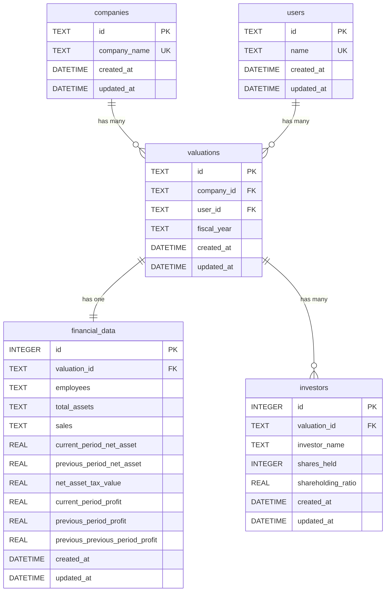

# データベース ER図

## エンティティ関連図（ER Diagram）

```
┌─────────────────────────────────┐       ┌─────────────────────────────────┐
│         companies               │       │           users                 │
│  (会社マスタ)                    │       │  (担当者マスタ)                  │
├─────────────────────────────────┤       ├─────────────────────────────────┤
│ PK  id (TEXT)                   │       │ PK  id (TEXT)                   │
│     company_name (TEXT) UNIQUE  │       │     name (TEXT) UNIQUE          │
│     created_at (DATETIME)       │       │     created_at (DATETIME)       │
│     updated_at (DATETIME)       │       │     updated_at (DATETIME)       │
└──────────────┬──────────────────┘       └──────────────┬──────────────────┘
               │                                         │
               │ 1                                       │ 1
               │                                         │
               │ has many                                │ has many
               │                                         │
               │ *                                       │ *
               └──────────────┬──────────────────────────┘
                              ▼
                  ┌─────────────────────────────────┐
                  │         valuations              │
                  │  (評価レコード)                  │
                  ├─────────────────────────────────┤
                  │ PK  id (TEXT)                   │
                  │ FK  company_id (TEXT)           │
                  │ FK  user_id (TEXT)              │
                  │     fiscal_year (TEXT)          │
                  │     created_at (DATETIME)       │
                  │     updated_at (DATETIME)       │
                  │                                 │
                  │ UNIQUE(company_id, fiscal_year) │
                  └──────────┬──────────────────────┘
                             │
                             │ 1
                             │
                             ├─────────────────────────┐
                             │                         │
                             │ has one                 │ has many
                             │                         │
                             │ 1                       │ *
                             ▼                         ▼
                  ┌──────────────────────┐  ┌──────────────────────────┐
                  │  financial_data      │  │      investors           │
                  │  (財務データ)        │  │  (投資家)                │
                  ├──────────────────────┤  ├──────────────────────────┤
                  │ PK  id (INTEGER)     │  │ PK  id (INTEGER)         │
                  │ FK  valuation_id     │  │ FK  valuation_id (TEXT)  │
                  │     (TEXT)           │  │     investor_name (TEXT) │
                  │     employees (TEXT) │  │     shares_held (INT)    │
                  │     total_assets     │  │     shareholding_ratio   │
                  │     (TEXT)           │  │     (REAL)               │
                  │     sales (TEXT)     │  │     created_at (DATETIME)│
                  │     current_period_  │  │     updated_at (DATETIME)│
                  │     net_asset (REAL) │  └──────────────────────────┘
                  │     previous_period_ │
                  │     net_asset (REAL) │
                  │     net_asset_tax_   │
                  │     value (REAL)     │
                  │     current_period_  │
                  │     profit (REAL)    │
                  │     previous_period_ │
                  │     profit (REAL)    │
                  │     previous_        │
                  │     previous_period_ │
                  │     profit (REAL)    │
                  │     created_at       │
                  │     (DATETIME)       │
                  │     updated_at       │
                  │     (DATETIME)       │
                  └──────────────────────┘
```

## リレーションシップの詳細

### 1. companies → valuations（1対多）

- **関係**: 1つの会社は複数の評価レコードを持つ
- **外部キー**: `valuations.company_id` → `companies.id`
- **カーディナリティ**: 1:N
- **制約**: `ON DELETE CASCADE`（会社を削除すると関連する全評価も削除）
- **UNIQUE制約**: 同じ会社の同じ年度の評価は1つのみ（company_id, fiscal_year）

**例**:
```
株式会社A（company_id: comp_001）
  ├─ 2024年3月期の評価（valuation_id: val_001）
  ├─ 2023年3月期の評価（valuation_id: val_002）
  └─ 2022年3月期の評価（valuation_id: val_003）
```

### 2. users → valuations（1対多）

- **関係**: 1人の担当者は複数の評価レコードを担当できる
- **外部キー**: `valuations.user_id` → `users.id`
- **カーディナリティ**: 1:N
- **制約**: `ON DELETE CASCADE`（担当者を削除すると関連する全評価も削除）

**メリット**:
- 担当者名の表記ゆれを防止
- 担当者の名前変更時、usersテーブルの1レコードを更新するだけで全ての評価に反映
- 担当者別のレポート作成が容易

**例**:
```
山田太郎（user_id: user_001）
  ├─ 株式会社Aの2024年3月期評価を担当
  ├─ 株式会社Bの2024年3月期評価を担当
  └─ 株式会社Cの2023年3月期評価を担当
```

### 3. valuations → financial_data（1対1）

- **関係**: 1つの評価レコードは1つの財務データを持つ
- **外部キー**: `financial_data.valuation_id` → `valuations.id`
- **カーディナリティ**: 1:1
- **制約**: `ON DELETE CASCADE`（評価を削除すると財務データも削除）

**例**:
```
2024年3月期の評価（valuation_id: val_001）
  └─ 財務データ（従業員数、総資産、売上、利益など）
```

### 4. valuations → investors（1対多）

- **関係**: 1つの評価レコードは複数の投資家情報を持つ
- **外部キー**: `investors.valuation_id` → `valuations.id`
- **カーディナリティ**: 1:N
- **制約**: `ON DELETE CASCADE`（評価を削除すると投資家情報も削除）

**例**:
```
2024年3月期の評価（valuation_id: val_001）
  ├─ 投資家A（保有株数: 1000株、持株比率: 30%）
  ├─ 投資家B（保有株数: 500株、持株比率: 15%）
  └─ 投資家C（保有株数: 300株、持株比率: 9%）
```

## データフロー例

### 新規評価データ作成時

```
1. companies テーブルに会社が存在しない場合 → 新規作成
2. valuations テーブルに評価レコードを作成
3. financial_data テーブルに財務データを作成
4. investors テーブルに投資家データを複数作成
```

### 評価データ削除時（カスケード削除）

```
1. valuations テーブルから評価レコードを削除
   ↓ CASCADE
2. financial_data テーブルから関連する財務データが自動削除
   ↓ CASCADE
3. investors テーブルから関連する投資家データが自動削除

※ companies テーブルの会社データは残る（他の評価で使用される可能性があるため）
```

## インデックス

パフォーマンス最適化のため、以下のインデックスが作成されています:

1. `idx_valuations_company_id` - valuations.company_id（JOIN高速化）
2. `idx_financial_data_valuation_id` - financial_data.valuation_id（JOIN高速化）
3. `idx_investors_valuation_id` - investors.valuation_id（JOIN高速化）

## 正規化レベル

このスキーマは **第3正規形（3NF）** を満たしています:

- ✅ **第1正規形**: すべての属性が原子値（JSONではなく正規化されたテーブル）
- ✅ **第2正規形**: 部分関数従属性の除去（主キーに完全関数従属）
- ✅ **第3正規形**: 推移的関数従属性の除去（非キー属性間の依存関係なし）

## Mermaid形式のER図



## SQL JOIN例

### 完全なデータを取得するクエリ

```sql
-- 特定の評価データを全て取得
SELECT
  v.id,
  v.fiscal_year,
  v.person_in_charge,
  c.company_name,
  f.employees,
  f.total_assets,
  f.sales,
  f.current_period_net_asset,
  f.previous_period_net_asset,
  f.net_asset_tax_value,
  f.current_period_profit,
  f.previous_period_profit,
  f.previous_previous_period_profit,
  v.created_at,
  v.updated_at
FROM valuations v
JOIN companies c ON v.company_id = c.id
LEFT JOIN financial_data f ON v.id = f.valuation_id
WHERE v.id = ?;

-- 投資家データを取得
SELECT
  investor_name,
  shares_held,
  shareholding_ratio
FROM investors
WHERE valuation_id = ?;
```

### 会社別の評価履歴を取得

```sql
SELECT
  c.company_name,
  v.fiscal_year,
  f.current_period_profit,
  COUNT(i.id) as investor_count
FROM companies c
JOIN valuations v ON c.id = v.company_id
LEFT JOIN financial_data f ON v.id = f.valuation_id
LEFT JOIN investors i ON v.id = i.valuation_id
GROUP BY c.id, v.id
ORDER BY c.company_name, v.fiscal_year DESC;
```
